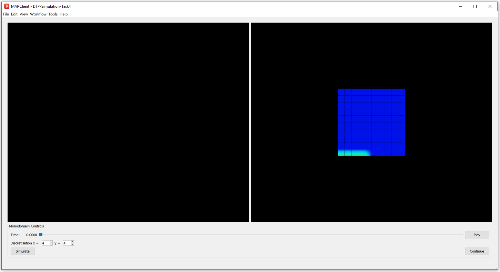
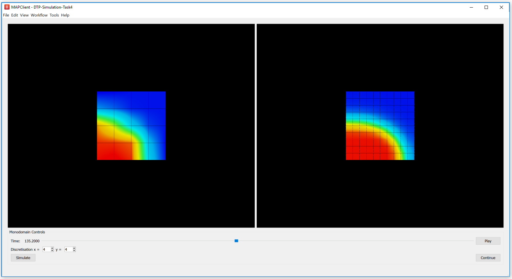

.. _dtp_cp_sim_multiscale:

Multiscale simulation
=====================

.. _dtp_cp_sim_ode_task4:

Task 4 - electrophysiological simulation
++++++++++++++++++++++++++++++++++++++++

In this example we explore the effect of spatial resolution of the numerical method in the simulation of a monodomain electrophysiology simulation.

1. Run MAP Client, choose :menuselection:`File --> Open` and select :file:`{HOME}/projects/mapclient-workflows/DTP-Simulation-Task4`.
2. This simple workflow should look similar to that used in task 1 above (:numref:`fig_dtp_cp_sim_euler1`). The workflow is pre-configured so there is no configuration required.
3. Click the :guilabel:`Execute` button and you should get a widget displayed as per :numref:`fig_dtp_cp_sim_task4_1`.

.. _fig_dtp_cp_sim_task4_1:

   
   The user interface in this task initially shows a "converged" solution on the right. The user is able to set the discretisation of the finite element mesh using the widgets at the bottom.
   
4. You can now investigate the effect of changing the spatial resolution. Example results are shown in :numref:`fig_dtp_cp_sim_task4_2`.

.. _fig_dtp_cp_sim_task4_2:

   
   Simulation results for a 2x1 mesh.
   
5. You need to be careful in your choice of mesh resolution as it can easily take forever to solve :) Have a play and think about the following questions.

   #. How long are you prepared to wait for a suitable simulation result?
   #. Why do you need a higher mesh resolution in the x-direction than the y-direction to achieve a reasonable solution?
   #. What is the lowest mesh resolution that gives a reasonable solution compared to the provided converged solution?
