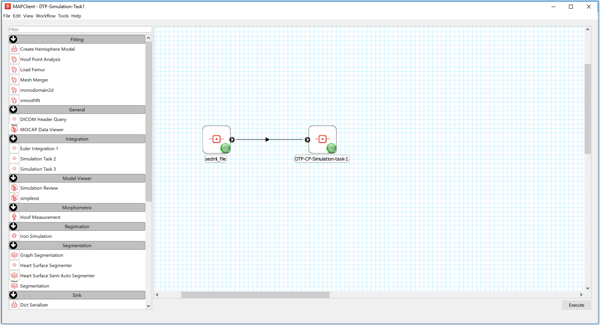
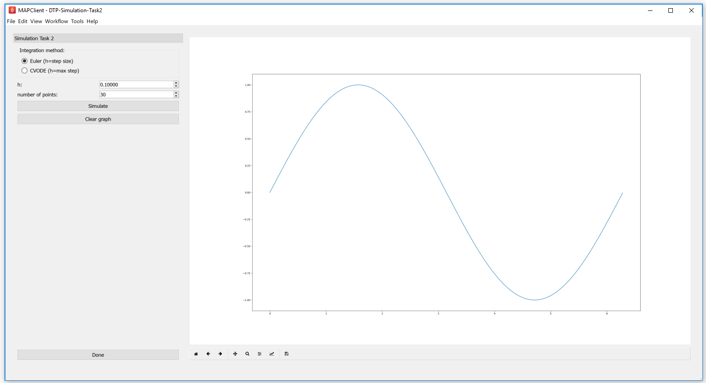
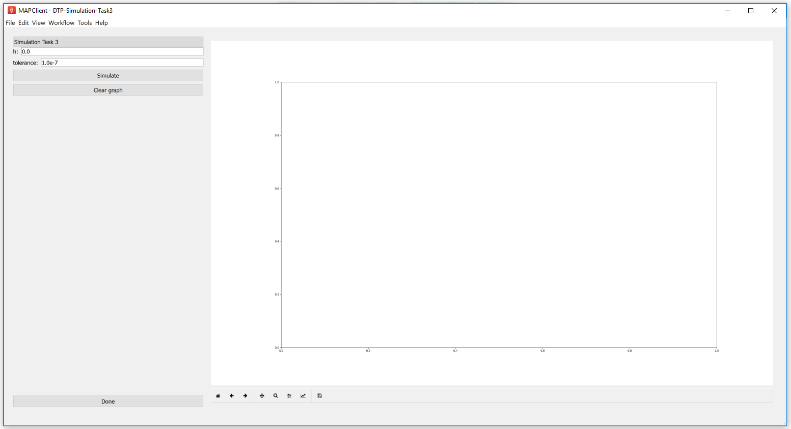
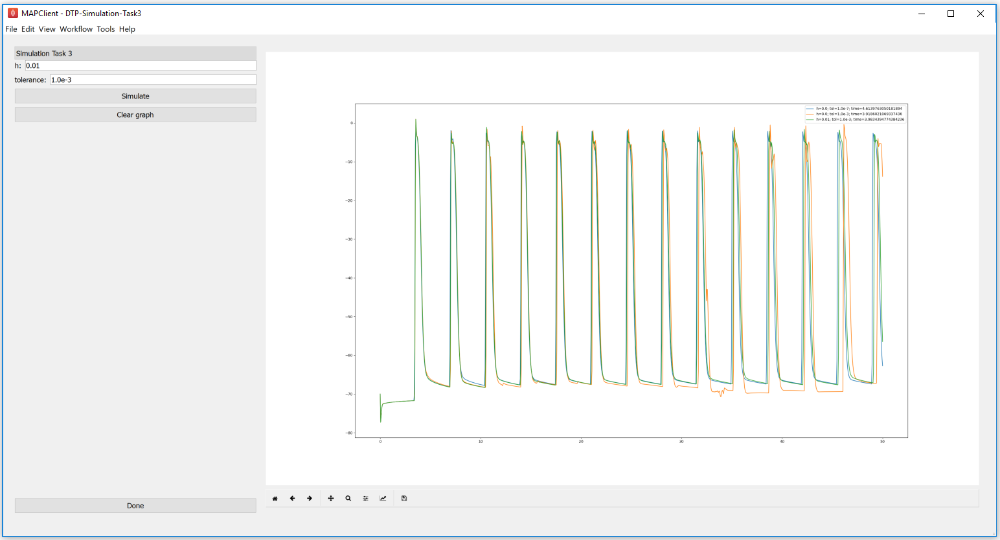

.. _dtp_cp_sim_odeintegration:

Integrating systems of differential equations
=============================================

In this tutorial we look into the integration of systems of differential equations, using example models from the domain of computational physiology. We also examine the the main control parameters that can have a significant impact on the performance and accuracy of a given method.

.. contents::
   :local: 
   :depth: 2
   :backlinks: top

.. _dtp_cp_sim_ode_integrators:

Numerical integrators
---------------------

.. _dtp_cp_sim_ode_euler:

Euler method
************

The `Euler method <http://en.wikipedia.org/wiki/Euler_method>`_ to integrate a system of ordinary differential equations is probably the most well known method, particularly popular given its simplicity. Due to its simplicity it is, however, usually not the most appropriate method to use when performing simulation experiments with complex models of biological systems. It is, however, a very useful example to use to demonstrate key concepts that apply to most numerical integration methods.

Given the initial value problem

.. math:: y'(t) = f(t, y(t)), \quad\quad y(t_0) = y_0, 
   :label: dtp_cp_sim_euler_system
   
we now want to approximate :math:`y(t)` over some interval :math:`t_0 \rightarrow t_{final}`. The Euler method approximates :math:`y(t)` by dividing the interval into a series of steps, of size :math:`h`, and stepping through the interval. One step of the Euler method from :math:`t_n` to :math:`t_{n+1} = t_n + h` is given by

.. math:: y_{n+1} = y_n + h f(t_n, y_n).
   :label: dtp_cp_sim_euler_step 

The value of :math:`y_n` is an approximation of the solution of the ODE :eq:`dtp_cp_sim_euler_system` at time :math:`t_n`: :math:`y_n \approx y(t_n)`. The Euler method proceeds through the interval in constant steps of size :math:`h` until :math:`t_n = t_{final}` and the integration is complete.

.. _dtp_cp_sim_ode_task1:

Task 1 - the effect of step size
++++++++++++++++++++++++++++++++

As you'd imagine, the size of :math:`h` in the Euler method is crucial to the successful application of the method. For the successful (although perhaps inaccurate) integration of a typical physiological model (see the `Physiome Repository <https://models.physiomeproject.org>`_ for a collection of examples), :math:`h` can be so small that the computational cost of performing the simulation is very high. In some cases, mathematical models may be unsuitable for integration by Euler method, regardless of how small the step size is reduced to.

In the follow task, we investigate the effect of altering the size of :math:`h` on two separate simulation experiments. The first looks at a simple mathematical model where the experiment could be replicated with pen and paper, while the second looks into the application of Euler's method to a biophysical model of cellular electrophysiology.

In this task we use the trivial model:

.. math::
   :label: dtp_cp_sim_sine_model
   
   x(t) &= \mathit{sin}(t),\\
   y'(t) &= \mathit{cos}(t) \quad\mathrm{with}\quad y(0) = 0.
   
As you can see from :eq:`dtp_cp_sim_sine_model`, if correctly integrated :math:`x(t)` and :math:`y(t)` should be identical. We now use this model to demonstrate the effect of step size (:math:`h`) on simulating this model using Euler integration over the interval :math:`0 \rightarrow 2 \pi`.

1. Run MAP Client, choose :menuselection:`File --> Open` and select :file:`{HOME}/projects/mapclient-workflows/DTP-Simulation-Task1`.
2. This simple workflow should look similar to :numref:`fig_dtp_cp_sim_euler1`. The workflow is pre-configured so there is no configuration required.

.. _fig_dtp_cp_sim_euler1:

   
   The first Euler example as loaded.
   
3. Click the :guilabel:`Execute` button and you should get a widget displayed as per :numref:`fig_dtp_cp_sim_euler2`.

.. _fig_dtp_cp_sim_euler2:

   
   The cool Euler integrator interface. In this simple interface, you will see the standard sine function, :math:`sin(t)`, plotted in the right hand panel. The toolbar under the plot is self-explanatory, but provides access to some nifty features. At the top of the left hand panel you will see the control to set the Euler step size for this model, :math:`h` and also the number of points to be obtained. The :guilabel:`Simulate` button will execute the Euler integration of the model :eq:`dtp_cp_sim_sine_model` and plot the result on the plot to the right. This can be repeated with various values of :math:`h`. The :guilabel:`Clear graph` button will, surprisingly, clear the current simulation results from the plot panel. The :guilabel:`Done` button will drop you back to the work-flow diagram, where you can get back to the plot by executing the work-flow once more.
   
4. As described in :numref:`fig_dtp_cp_sim_euler2`, multiple simulations can be performed with varying values for the step size, :math:`h`. Shown in :numref:`fig_dtp_cp_sim_euler3` you can see that as :math:`h` reduces in size, the approximation of the model :eq:`dtp_cp_sim_sine_model` by integration using the Euler method gets more accurate.

.. _fig_dtp_cp_sim_euler3:

   
   Simulation results demonstrating the effect of step size, :math:`h`, on the accuracy of Euler's method in approximating the solution of :eq:`dtp_cp_sim_sine_model`.
   
5. Now have a play with combining different values for the step size and the number of points to be obtained. See if you can answer the following.

   #. How small should :math:`h` be to accurately simulate a sine wave?
   #. What do you think would happen beyond a single cycle?
   #. Given :math:`h = 1`\ , do you obtain a more accurate solution with a large number of points or a small number of points?

.. _dtp_cp_sim_ode_cvode:

CVODE
*****

From the `Sundials <https://computation.llnl.gov/casc/sundials/main.html>`_ suite of tools, CVODE is a solver for stiff and nonstiff ordinary differential equation (ODE) systems (initial value problem) given in explicit form in :eq:`dtp_cp_sim_euler_system` above. CVODE is widely regarded as one of the gold standard implementations of a robust and flexible numerical integrator. One of the advantages of CVODE over Euler's method is that it makes use of adaptive stepping over the interval of integration - rather than taking fixed sized steps through time, for example, CVODE will determine how quickly things are changing and adjust the size of the step accordingly.

.. _dtp_cp_sim_ode_task2:

Task 2 - fixed vs adaptive stepping
+++++++++++++++++++++++++++++++++++

In this task we examine the limitations and the computational costs associated with a fixed step method (Euler) compared to an adaptive step method (CVODE). Here we continue with our sine integration demonstration model to help highlight the differences.

1. Run MAP Client, choose :menuselection:`File --> Open` and select :file:`{HOME}/projects/mapclient-workflows/DTP-Simulation-Task2`.
2. This simple workflow should look similar to that used in task 1 above (:numref:`fig_dtp_cp_sim_euler1`). The workflow is pre-configured so there is no configuration required.
3. Click the :guilabel:`Execute` button and you should get a widget displayed as per :numref:`fig_dtp_cp_sim_task2_1`.

.. _fig_dtp_cp_sim_task2_1:

   
   The user interface in this task is similar to that described in :numref:`fig_dtp_cp_sim_euler2`, and the common elements behave the same. In addition there is the ability to choose either the Euler or CVODE numerical integration methods. As the CVODE method is an adaptive stepping method, the value of :math:`h` is used to limit the maximum step size that the algorithm will use, with :math:`h=0` indicating the maximum step size is unlimited.
   
4. You can now easily see the difference between the two integration methods by directly comparing them, as shown in :numref:`fig_dtp_cp_sim_task2_2`.

.. _fig_dtp_cp_sim_task2_2:

.. figure:: _static/task2_2-new.png
   :align: center
   :figwidth: 95%
   :width: 90%
   :alt: Task 2 sample results.
   
   Simulation results showing the comparison between the Euler and CVODE integrators.

5. Now have a play with step sizes, number of points, and integration methods to explore the features of these two integration methods and see if you can address these questions.

   #. What is the largest maximum step size you can use with CVODE to accurately simulate a sine wave with number of points being set to 2?
   #. How small does :math:`h` need to be to get the same solution with Euler?
   #. Are either of those a useful solution?
   #. What is the minimum number of points required to capture an accurate sine wave?
   #. Can you determine a configuration for Euler and CVODE which demonstrates a cheaper, more accurate, simulation using CVODE with this model?

.. _dtp_cp_sim_ode_task3:

Task 3 - error control
++++++++++++++++++++++

In addition to providing adaptive stepping, CVODE is also a very configurable solver. Beyond the maximum step size explored above, a further control parameter of that is often of interest are the tolerances used to control the accumulation of error in the numerical approximation of the mathematical model. This tolerance specifies how accurate we require the solution of the integration to be, and the value used can be very specific to the mathematical model being simulated. In task 2 above, we used a tolerance of 1.0e-7. Depending on the behaviour of your mathematical model, you may need to tighten (reduce) or loosen (increase) the tolerance values, depending on the specific application the model is being used for. Here we explore the effect of the tolerance value on the ICC model introduced above.

We use the recent `biophysically based mathematical model of unitary potential activity in interstitial cells of Cajal <https://models.physiomeproject.org/exposure/988bef2de04476a20b1e76e9e933b86b>`_. The interstitial cells of Cajal (ICC) are the pacemaker cells of the gastrointestinal tract and provide the electrical stimulus required to activate the contraction of smooth muscle cells nescessary for the correct behaviour of the GI tract. This particular model was developed by scientists at the Auckland Bioengineering Institute to investigate a specific hypothesis regarding the biophysical mechanism underlying the pacemaker function of ICCs.

1. Run MAP Client, choose :menuselection:`File --> Open` and select :file:`{HOME}/projects/mapclient-workflows/DTP-Simulation-Task3`.
2. This simple workflow should look similar to that used in task 1 above (:numref:`fig_dtp_cp_sim_euler1`). The workflow is pre-configured so there is no configuration required.
3. Click the :guilabel:`Execute` button and you should get a widget displayed as per :numref:`fig_dtp_cp_sim_task3_1`.

.. _fig_dtp_cp_sim_task3_1:

   
   The user interface in this task is similar to that described in :numref:`fig_dtp_cp_sim_euler2`, and the common elements behave the same. We now are only using the CVODE integration method so :math:`h` is the maximum step size with :math:`h=0` indicating an unlimited step size. The tolerance value for the simulation can also be edited in this interface.
   
4. You can now investigate the effect of changing the tolerance value and maximum step size on the simulation result. Not all combinations will successfully complete. Example results are shown in :numref:`fig_dtp_cp_sim_task3_2`.

.. _fig_dtp_cp_sim_task3_2:

   
   Simulation results for a selection of simulations of the ICC model using various configurations of the CVODE integratior.
   
5. After exploring the effects of the integrator parameters and the simulated model behaviour, see if you can answer the following questions.

   #. With :math:`h=0.0`, how loose can the tolerance be and still get an accurate solution?
   #. How tight can you make the tolerance before the computational cost outweighs any improvement in solution accuracy?
   #. Is there any value of :math:`h` that will give an accurate solution for a tolerance of 0.01?